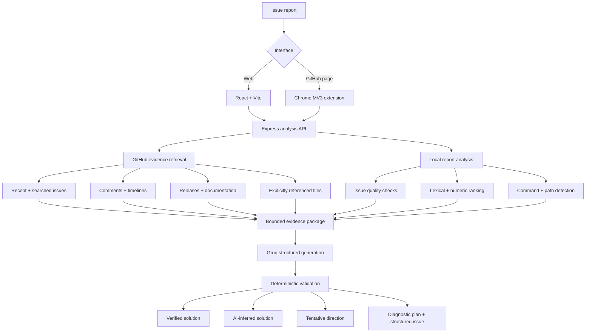
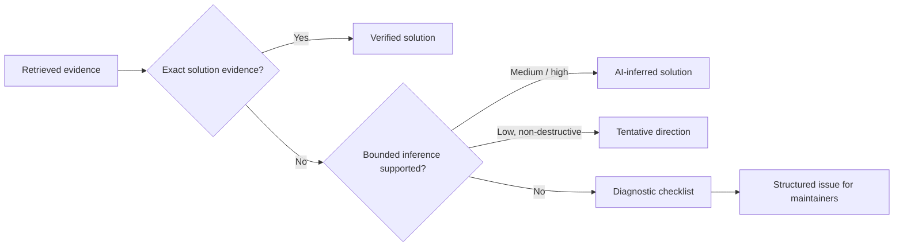

<div align="center">

# RootLore

### Evidence-grounded GitHub issue intelligence

**Find repository-supported solutions, reason safely from project context, and
turn unresolved problems into maintainer-ready issues.**

[](https://developer.mozilla.org/docs/Web/JavaScript)
[](https://react.dev/)
[](https://nodejs.org/)
[](https://developer.chrome.com/docs/extensions/)
[](#verification)
[](#verification)

`React web app` · `Chrome extension` · `Express API` · `GitHub REST API` · `Groq GenAI`

</div>

---

RootLore reads repository issues, maintainer discussions, documentation,
releases, and explicitly referenced files before asking GenAI for help. It
returns a cited remediation when evidence supports one. Otherwise, it creates a
structured issue and explains exactly what diagnostic information is missing.

> **Core principle:** be conservative about unsupported specifics, not
> conservative about providing useful direction.

## Quick navigation

- [Why RootLore](#why-rootlore)
- [Outcomes](#outcomes)
- [Architecture](#architecture)
- [Safety controls](#hallucination-and-safety-controls)
- [Features](#main-features)
- [Local setup](#local-setup)
- [Chrome extension](#chrome-extension)
- [API](#api)
- [Verification](#verification)
- [Deployment](#deployment-checklist)

## At a glance

| Area | Implementation |
| --- | --- |
| Main use case | Solve GitHub issues from repository evidence or improve the report |
| Evidence | Issues, comments, timelines, releases, docs, and referenced files |
| GenAI | Groq structured generation using `openai/gpt-oss-20b` |
| Grounding | Exact quote validation plus deterministic post-generation checks |
| Interfaces | Responsive React application and Chrome Manifest V3 extension |
| Efficiency | Bounded retrieval, ETags, caching, and in-flight request deduplication |
| Validation | 44 automated tests and a labeled retrieval regression suite |

## Why RootLore

Useful fixes are often scattered across closed issues, comments, README files,
troubleshooting guides, and release notes. A normal chatbot may miss this project
context or confidently invent a fix. Repository owners also receive incomplete
reports without reproduction steps, versions, environments, or logs.

RootLore addresses both problems:

1. It retrieves a small, relevant evidence set from the selected repository.
2. It uses GenAI to reason over that evidence rather than answer from memory.
3. It validates generated citations and technical specifics after generation.
4. It returns either a supported solution, a clearly labelled inference, a safe
   diagnostic direction, or a maintainer-ready issue.

## Outcomes

Every analysis ends with one explicit outcome:

| Outcome | Meaning | UI treatment |
| --- | --- | --- |
| `verified_solution` | Exact documentation or a confirmed resolved-issue comment supports the action. | Repository verified |
| `inferred_solution` | Repository structure or validated context strongly implies a bounded fix. | AI-inferred; review required |
| `possible_remediation` | A low-confidence, non-destructive direction may help but is not confirmed. | Unverified direction |
| `structured_issue` | No responsible fix can yet be supported; diagnostic details are requested. | Diagnosis incomplete |

RootLore separates **solution citations** from **context citations** so similar
issues do not look like proof that a fix will work.

## Example behavior

For a vague report such as:

```text
Application crashes on Windows when opening Developer Tools.
The console shows an error.
```

RootLore may find similar DevTools reports, but it does not copy their errors
into the user's report or present similarity as the same root cause. Instead, it
asks for the exact error, browser/extension versions, and reproduction details.

For a bounded repository change such as adding an entry to a documented JSON
data file, RootLore does not require an identical historical fix. It can return a
medium-confidence recommendation to follow neighboring entries, preserve valid
JSON syntax, and validate the file—while leaving exact placement as unknown.

## Architecture



### Decision flow



## Retrieval and generation pipeline

1. Validate the repository name and submitted report.
2. Fetch up to 100 recent repository issues and run a short cached GitHub search
   for older matching issues.
3. Rank issues locally using title, labels, body terms, and exact error signals.
4. Enrich only the three strongest issues with comments and timeline events.
5. Cache up to 20 useful documentation files, bounded to 750 KB per repository,
   and rank small passages locally.
6. Retrieve at most three explicitly named source/data/configuration files. This
   includes common code formats plus JSON, JSONC, YAML, TOML, and INI.
7. Send at most four repository passages and the selected issue evidence to
   Groq using a strict JSON Schema.
8. Validate every returned quote and decision before rendering it.

This keeps prompts and GitHub API usage bounded; RootLore never sends an entire
repository to the model.

## Hallucination and safety controls

Prompt instructions are not treated as the only security boundary. The backend
also enforces deterministic checks:

- Generated issue citations must refer to retrieved issue numbers.
- Every supporting quote must exist verbatim in the matching issue or document.
- The currently viewed issue cannot be returned as its own duplicate.
- A closed issue becomes solution evidence only when the closing actor explicitly
  confirms that a step fixed, solved, resolved, or worked.
- `not_planned`, stale, and unconfirmed closures are not treated as fixes.
- Generated version numbers must already exist in the report or evidence.
- Low-confidence guesses cannot recommend destructive/state-changing actions such
  as disabling, deleting, upgrading, downgrading, or applying a patch without
  solution evidence.
- Retrieved logs, versions, and reproduction steps cannot be inserted into the
  reporter's improved issue as if the reporter observed them.
- Context-only claims are labelled as similarity, never confirmed causation.
- Repository text is evidence of repository intent, not automatic proof of
  technical correctness.

## Main features

- Evidence-grounded GenAI troubleshooting
- Claim-level issue and documentation citations
- Older issue discovery beyond the recent-issues window
- Comment, closure-timeline, linked-PR, commit, and release context
- Explainable lexical retrieval with error and numeric relevance signals
- Numeric-nearness ranking (for example, 998 requests matches a documented
  1,000-request quota)
- Medium-confidence bounded inference without requiring an exact previous fix
- README-grounded command typo detection
- Structured issue title, environment, reproduction, expected/actual behavior,
  and error placeholders
- Explainable issue-quality scoring
- Chrome extension detection of existing issues and new-issue drafts
- Copy or insert an improved report into GitHub
- Evidence-aware result UI with verified, inferred, tentative, and incomplete
  states
- Local analysis history in the web browser
- In-memory caching, ETag revalidation, in-flight request deduplication, timeouts,
  rate limiting, and restricted CORS

## Technology

- JavaScript (ES modules)
- React and Vite
- Node.js and Express
- Chrome Manifest V3
- GitHub REST API
- Groq API with `openai/gpt-oss-20b`
- Strict JSON Schema structured output
- Node.js built-in test runner

## Repository structure

```text
RootLore/
├── src/                    Express API and services
│   ├── routes/             Repository endpoints
│   ├── services/           GitHub retrieval, ranking, and Groq validation
│   └── middleware/         API rate limiting
├── web/                    React/Vite interface
├── extension/              Chrome Manifest V3 extension
├── test/                   Unit and integration tests
├── evaluation/             Labeled retrieval regression cases
└── docs/INTERVIEW.md       Interview explanation and trade-offs
```

## Local setup

Requirements: Node.js 20 or newer and npm.

1. Install backend dependencies:

   ```powershell
   npm install
   ```

2. Install frontend dependencies:

   ```powershell
   cd web
   npm install
   cd ..
   ```

3. Create `.env` from `.env.example` and add your credentials:

   ```env
   PORT=3000
   GITHUB_TOKEN=github_pat_your_token
   GROQ_API_KEY=gsk_your_key
   CORS_ORIGINS=http://localhost:5173,http://localhost:5174,http://localhost:5183
   ```

   `GITHUB_TOKEN` is optional for public repositories, but authentication raises
   the GitHub API rate limit. Token permissions still determine which private
   repositories it can read. Keep both tokens on the backend and never commit
   `.env`.

4. Start the backend:

   ```powershell
   npm run dev
   ```

5. Start the frontend in another terminal:

   ```powershell
   cd web
   npm run dev
   ```

6. Open the Vite URL, normally `http://localhost:5173`.

## Chrome extension

1. Start the RootLore backend.
2. Open `chrome://extensions`.
3. Enable **Developer mode**.
4. Select **Load unpacked** and choose the `extension` directory.
5. Open an existing GitHub issue or a repository's `/issues/new` page.
6. Open RootLore from the browser toolbar and select **Analyze with GenAI**.

The extension reads visible issue content, but all GitHub and Groq credentials
remain on the backend. Its settings page can switch from localhost to a deployed
API. The manifest currently permits localhost and Render hosts; update
`host_permissions` when using another provider.

## API

Health check:

```http
GET /health
```

Normalized repository issues:

```http
GET /api/repositories/:owner/:repository/issues
```

Analyze a report:

```http
POST /api/repositories/:owner/:repository/analyze
Content-Type: application/json

{
  "title": "Login fails with invalid_grant",
  "description": "Version 0.56.0 fails on Ubuntu after Google authentication.",
  "issueNumber": 29069
}
```

`issueNumber` is optional and is used by the extension when analyzing an existing
issue. The response contains optimization statistics, selected evidence, releases,
ranked passages, cache status, model metadata, validated claims, the improved
report, and the explicit outcome.

## Caching and API efficiency

- Recent issue cache: 15 minutes
- Comments, timelines, and supporting evidence: 6 hours
- Repository documentation: 24 hours
- Identical Groq analysis: 24 hours
- GitHub ETag revalidation for stale cached responses
- Shared in-flight requests for concurrent identical calls
- Brief failure caching to avoid repeatedly hammering an unhealthy dependency
- Maximum three enriched issues and three explicit files per analysis
- Per-IP limit of 10 analyses per 10 minutes

Caches are currently in memory and reset when the backend restarts.

## Verification

Run all automated tests:

```powershell
npm test
```

Run the labeled retrieval evaluation:

```powershell
npm run evaluate
```

Run tests, evaluation, and the production web build:

```powershell
npm run check
```

Current local baseline:

- 44 automated tests passing
- 4/4 retrieval evaluation cases passing
- 100% top-1 accuracy on the bundled regression set
- Successful Vite production build

The four evaluation cases are a regression baseline, not a claim of universal
real-world accuracy. See [`evaluation/README.md`](evaluation/README.md).

## Deployment checklist

- Deploy the Express API and configure `GITHUB_TOKEN`, `GROQ_API_KEY`, and
  `CORS_ORIGINS` as server-side environment variables.
- Deploy `web/dist` or connect the `web` project to a static hosting provider.
- Set `VITE_API_URL` to the deployed API before building the frontend.
- Configure the extension API URL from its settings page.
- Add the production API host to the extension manifest when it is not on Render.
- Run `npm run check` before publishing a release.

## Limitations

- Retrieval uses explainable lexical scoring rather than an embedding/vector
  database, so conceptual matches without shared terms may be missed.
- Only bounded documentation and explicitly named files are inspected; RootLore
  does not understand every file in a repository.
- GitHub Discussions and complete pull-request diffs are not currently indexed.
- In-memory caches are not shared across multiple backend instances.
- Browser history is local and has no user authentication or cloud sync.
- AI-inferred and tentative actions always require human review.
- A vague report may correctly produce a diagnostic checklist instead of a fix.

## Placement summary

> Built an evidence-grounded GitHub issue assistant using multi-source RAG,
> bounded repository retrieval, strict structured generation, deterministic
> citation and hallucination validation, confidence-aware solution inference,
> API-efficient caching, a React interface, and a Chrome Manifest V3 extension.

For the short project pitch, architecture decisions, trade-offs, and interview
questions, see [`docs/INTERVIEW.md`](docs/INTERVIEW.md).
